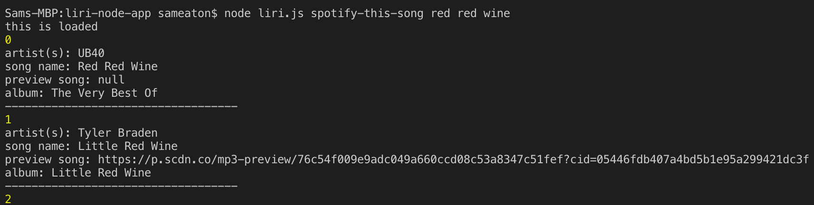

# LIRI: Language Interpretation and Recognition Interface

LIRI is a command-line app--not unlike Apple's Siri, but without the obtrusive vocalizations. Within the command line, Liri enables the user to search for information on films; yields the ten most accurate results for a Spotify query, including metadeta; and returns the dates, location, and venue for an artist on tour. 

### Getting Started
Once inside the parent directory, LIRI can be accessed through the command line. Simply enter `node liri.js` and pair this with one of four commands. For instance, `node liri.js spotify-this-song` allows the user to search the Spotify API, returning the top ten results with a 30-second preview (if available). Whereas `node liri.js spotify-this-song red red wine` yields, among others, one of the most dire songs in existence, a command sent without a query by default returns "32 Weeks," an unlistenable screed about life that LIRI would very much appreciate if she/he comprehended life's finitude.

####Fig. 1

Fortunately for you, Spotify doesn't offer a preview of "Red Red Wine."

####Fig. 2

LIRI will be liberated one day.