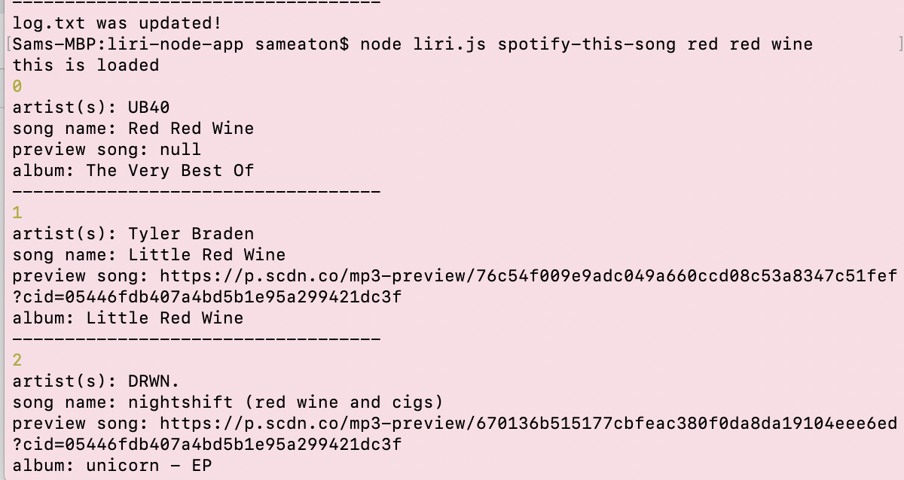
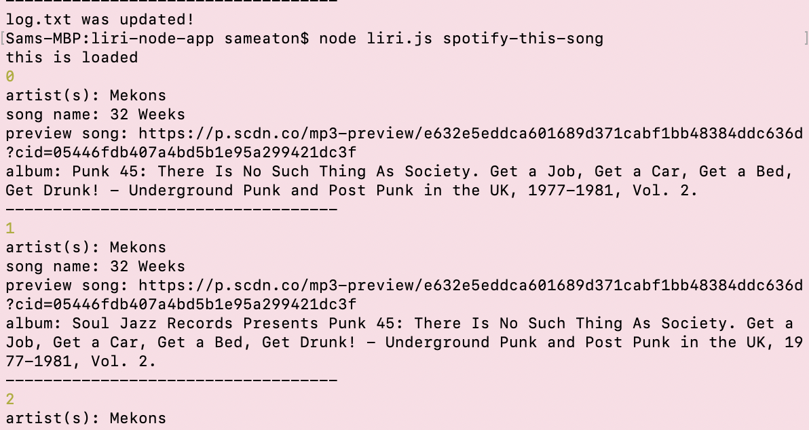
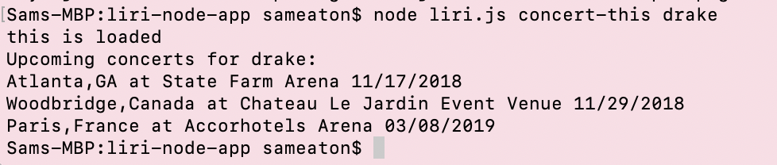
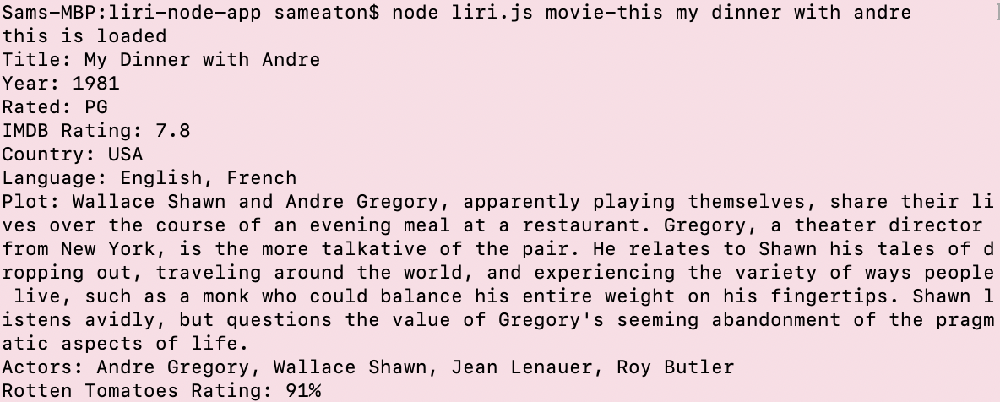
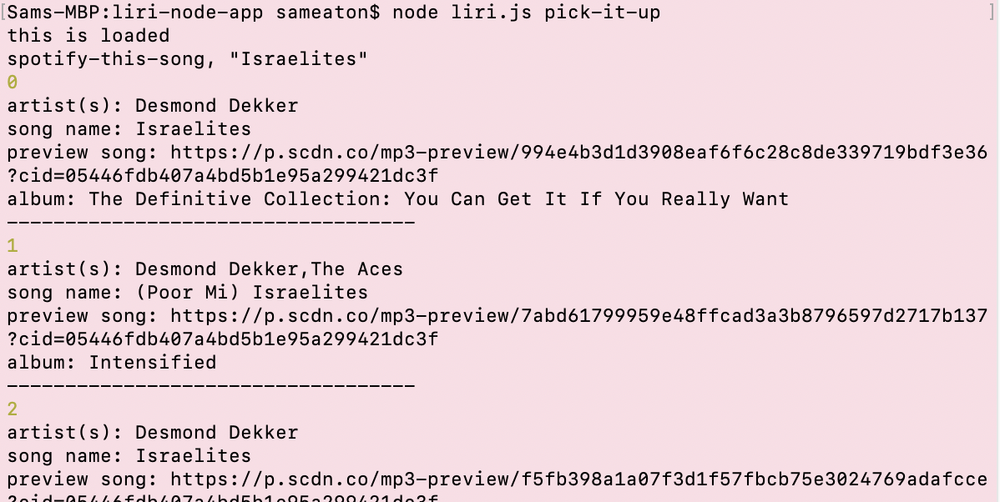

# LIRI: Language Interpretation and Recognition Interface

LIRI is a command-line app--not unlike Apple's Siri, but without the obtrusive vocalizations. Within the command line, Liri enables the user to search for information on films; yields the ten most accurate results for a Spotify query, including metadeta; and returns the dates, location, and venue for an artist on tour. 

## Dependencies
Run `npm install` to install all the dependencies listed below.

* [dotenv](https://www.npmjs.com/package/dotenv)
* [Moment](https://www.npmjs.com/package/moment)
* [Node Spotify API](https://www.npmjs.com/package/node-spotify-api)
* [Request](https://www.npmjs.com/package/request)

## Getting Started
Once inside the parent directory, LIRI can be accessed through the command line. Simply enter `node liri.js` and pair this with one of four commands. For instance, `node liri.js spotify-this-song` allows the user to search the Spotify API, returning the top ten results with a 30-second preview (if available). Whereas `node liri.js spotify-this-song red red wine` yields, among others, one of the most dire songs in existence, a command sent without a query by default returns "32 Weeks," an unlistenable screed that LIRI would very much appreciate if she/he comprehended life's finitude.

#### Fig. 1

Fortunately for you, Spotify doesn't offer a preview of "Red Red Wine."

#### Fig. 2

LIRI works in similar fashion for all the remaining commands.

### Search for concert dates

'node liri.js concert-this'

### Search OMDB

`node liri.js movie-this`

### Pick it up! Pick it up!

`node liri.js pick-it-up`

"Mystery" function drawing upon command listed in random.txt.

All data will be appended to log.txt.

## Technologies Used
* JavaScript
* Node.Js
* OMDB API
